# IPD20-SPRING-Chatroom

This project implements user login, create channels, chatting rooms, etc. with Spring boot. 
Deployed on <a href="http://35.203.70.240/" target = "_blank">http://35.203.70.240/</a>

#### **User Story:**
<ul>
<li>User can enter different chat rooms from different sessions</li>
<li>User can create/delete own chat rooms</li>
<li>User can mark/remove favorite chat rooms</li>
<li>Refresh user chatting status</li>
<li>Push notification to users</li>
<li>Pagination/Search/Richtext input/Emoji/Highlight @user etc...</li>
</ul>

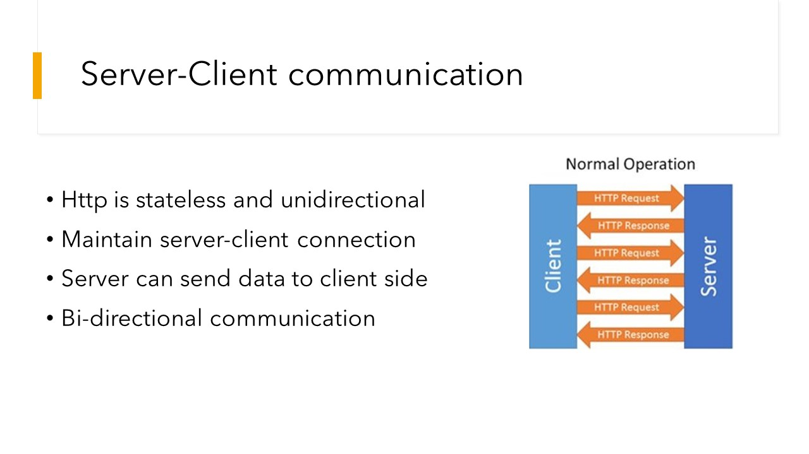

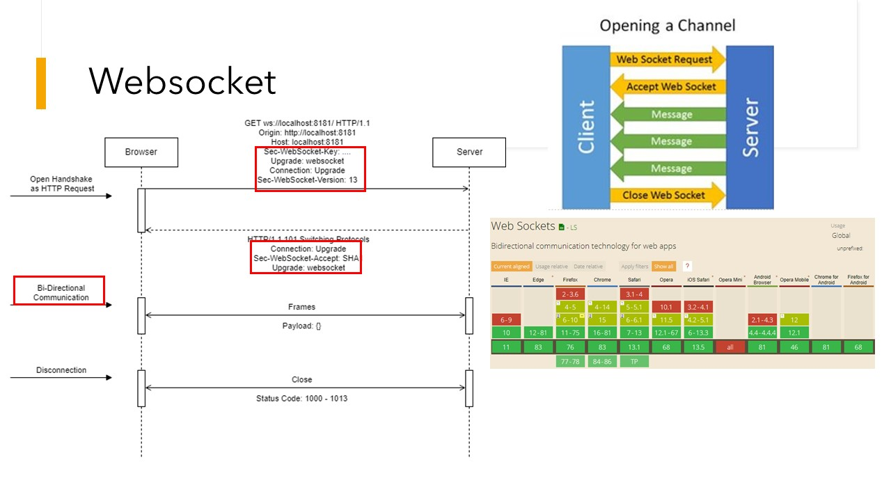

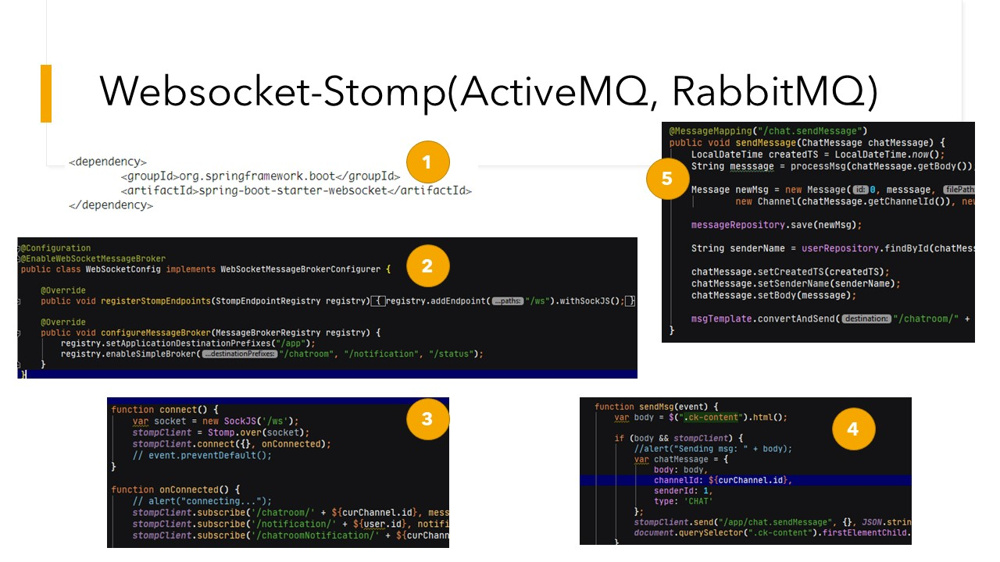

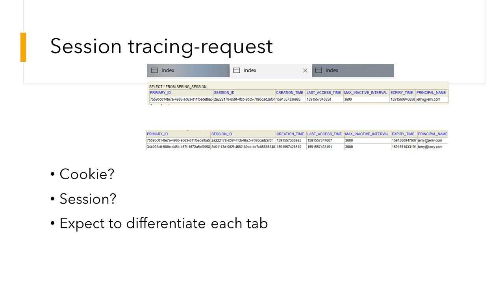

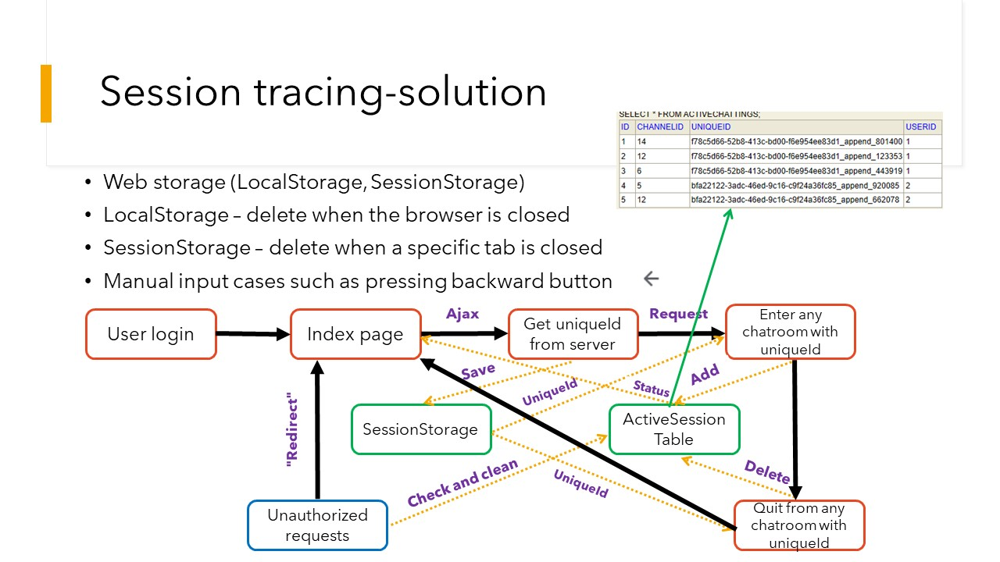

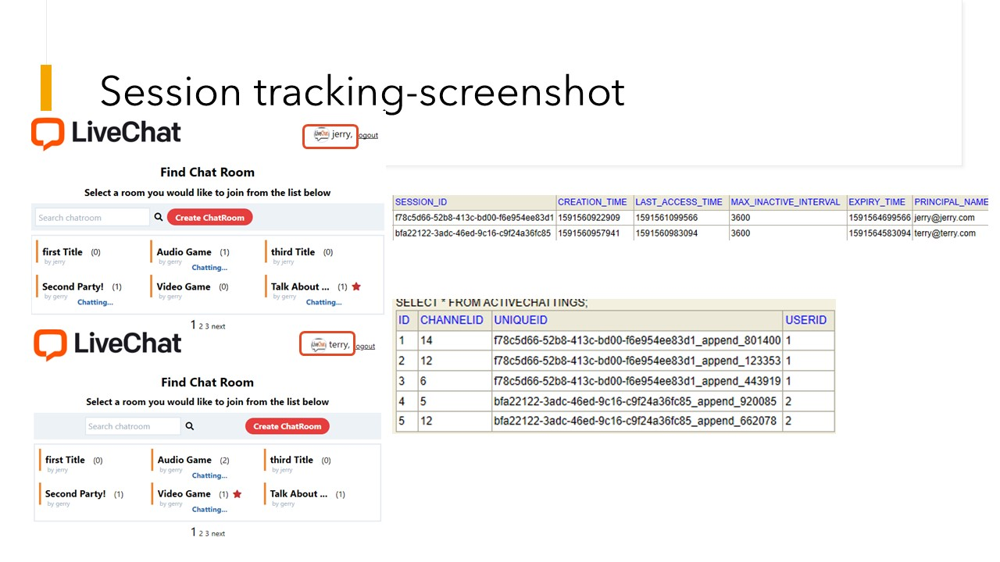

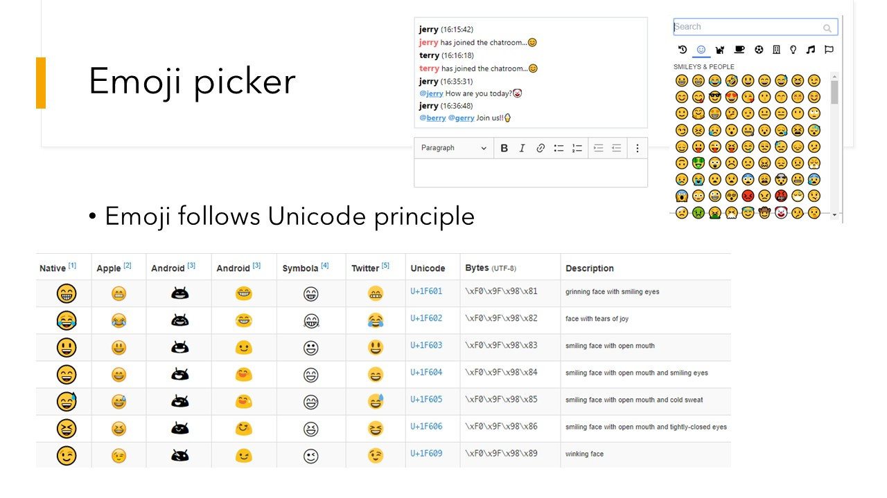

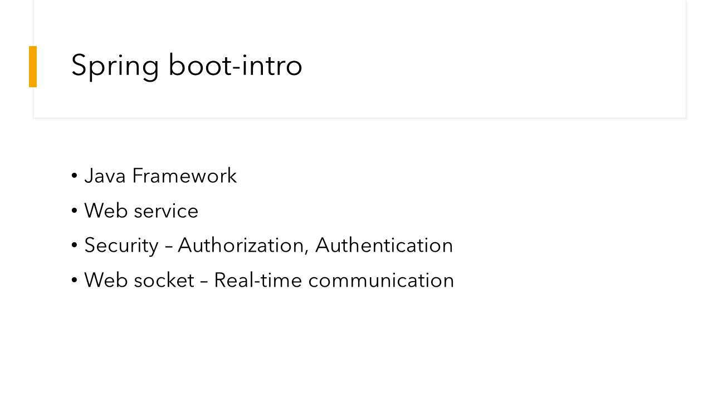

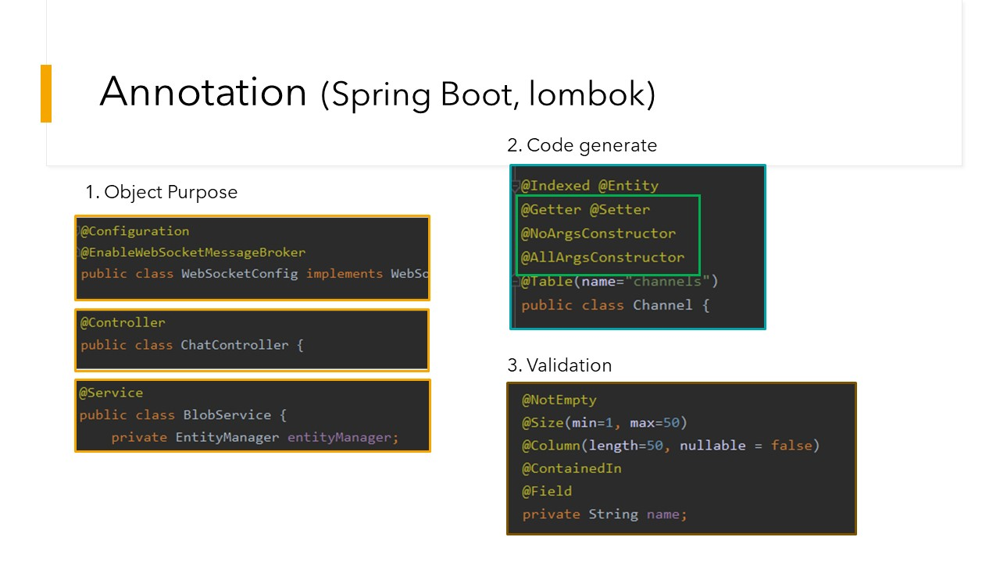

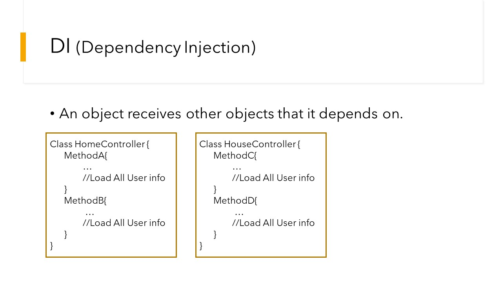

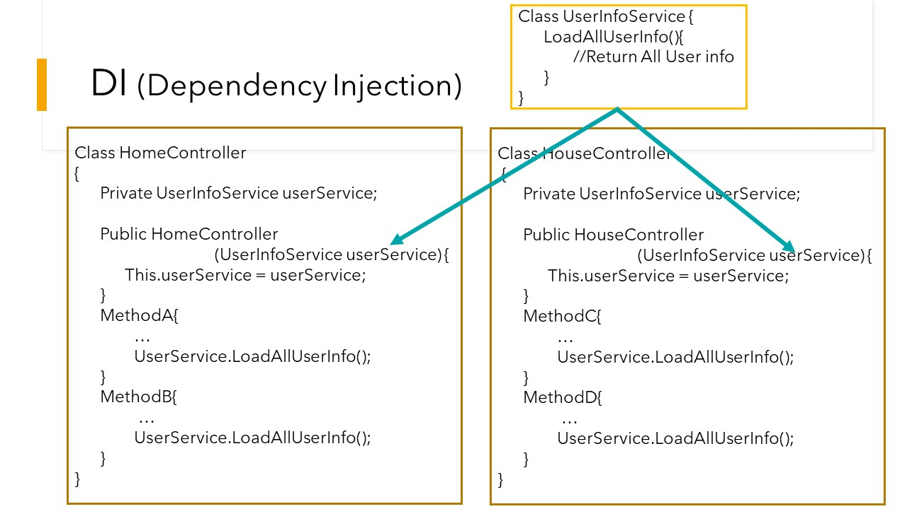

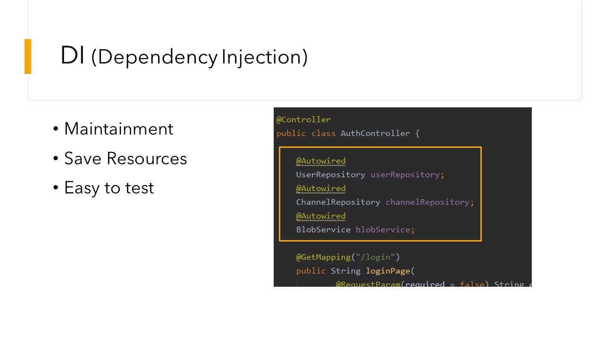

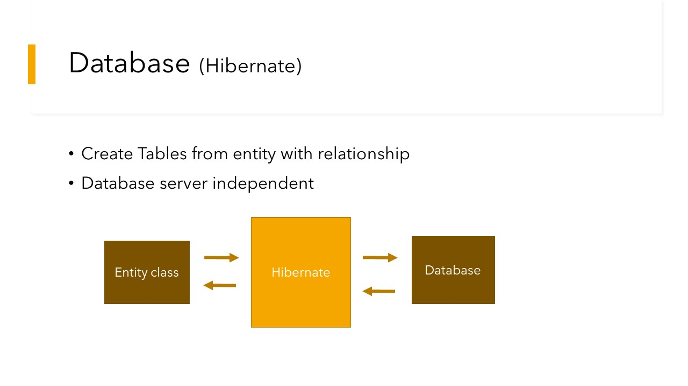

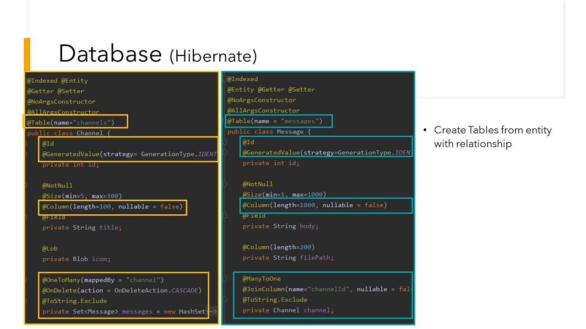

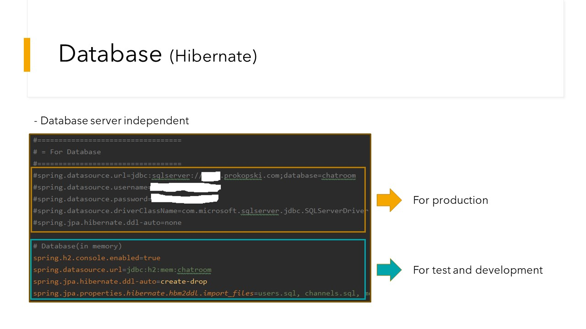

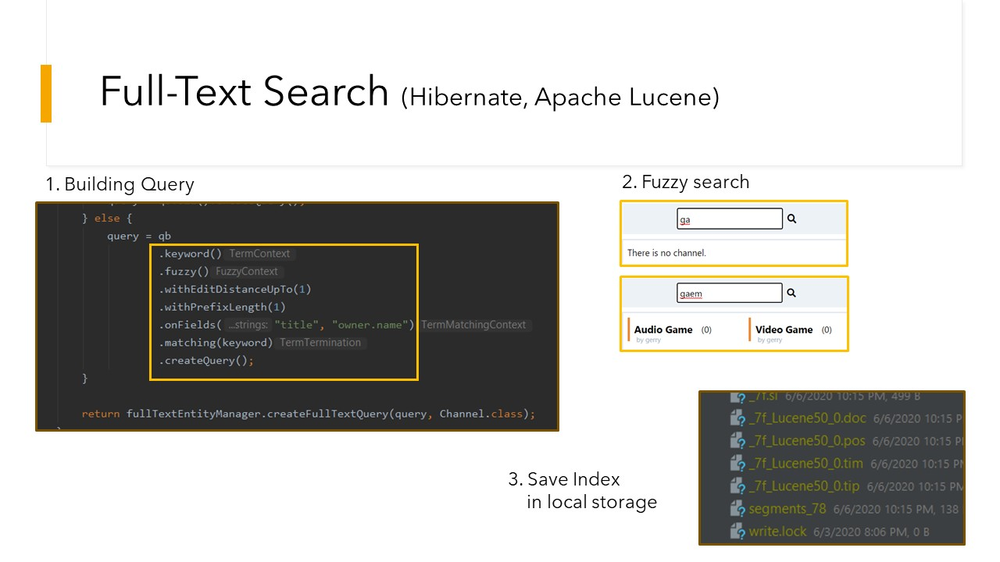

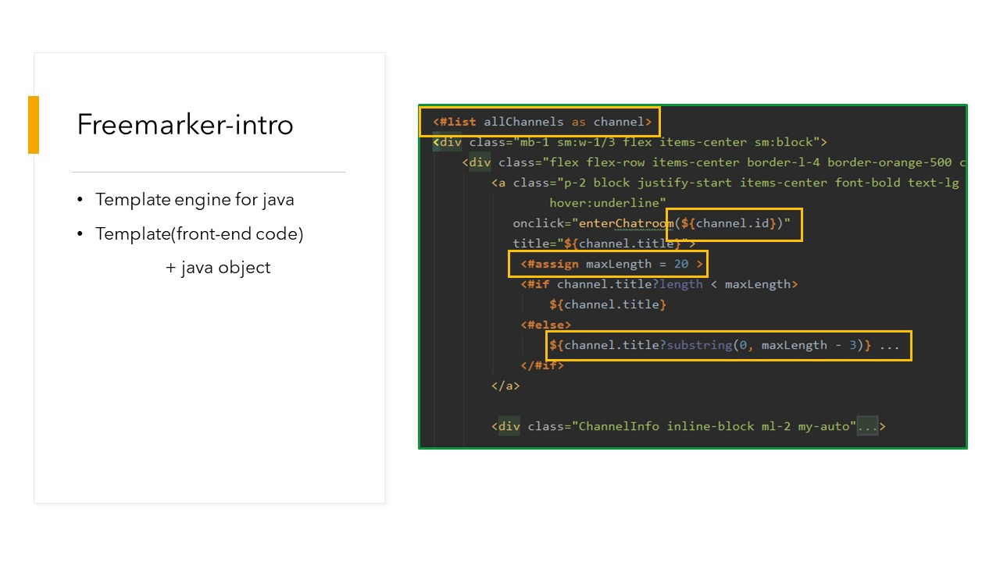

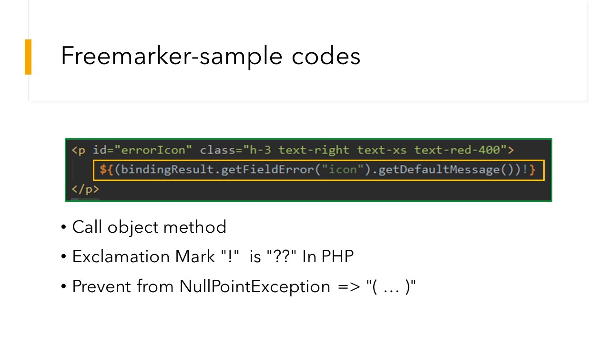

